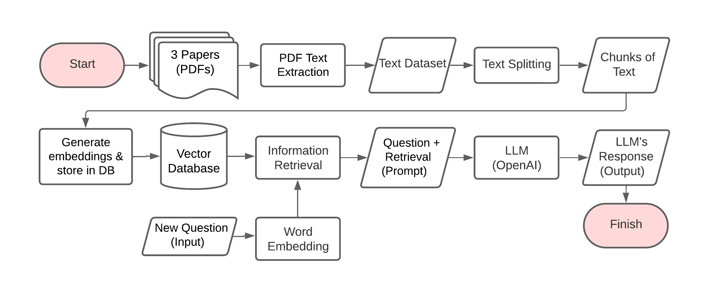

# RAGDocs (Retrieval-Augmented Generation for PDFs 📚)
This project focuses on developing an LLM-RAG (Retrieval-Augmented Generation) application using the OpenAI API for document understanding. The primary goal is to help users quickly extract insights from various documents, such as research papers, proposals, and reports, by allowing them to ask questions directly. This application is designed to streamline information retrieval, reducing the time and effort required to find specific details within lengthy documents.
## Methodology

The following diagram illustrates the workflow of the **RAGDocs**, which enables users to retrieve relevant information from documents efficiently.
1. **Document Processing**
- The system starts by inputting multiple PDF documents (e.g., research papers, proposals, reports).
- PDF text extraction is performed to convert the documents into raw text using PyPDFLoader from LangChain.
- The extracted text is structured into a dataset and then split into smaller chunks for better processing using RecursiveCharacterTextSplitter form LangChain.
2. **Embedding Generation & Storage**
- Each text chunk is transformed into vector embeddings using OpenAI Embedding and stored in a FAISS vector database.
- This enables efficient retrieval of relevant document sections when queried.
3. **Query Handling & Information Retrieval**
- When a new user question is received, it undergoes word embedding transformation to match it with relevant stored embeddings.
- The system performs information retrieval to fetch the most relevant text chunks from the database.
4. **LLM Response Generation**
- The retrieved text is combined with the user's question to form a structured prompt.
- This prompt is sent to the LLM (OpenAI API) for processing.
- The model generates a contextual response based on both the query and retrieved text.
5. **Output Delivery**
- The generated response is displayed to the user, providing precise and contextually relevant information.
- This significantly reduces the time required to search for specific details within large documents.
## Installation & Usage
1. **Install Dependencies**
- Run the following command to install the required dependencies from `requirements.txt`:
```python
pip install -r requirements.txt
```
2. **Input your OpenAI API Key**
- Change the OpenAI API Key in the `.env` file:
```python
'OPENAI_API_KEY' = 'your-openai-api-key'
```
3. **Run the Main Script**
- Execute the main Python script:
```python
python main.py
```
4. **Run the Streamlit App**
- To start the Streamlit application, use:
```python
streamlit run main.py
```
## Testing

